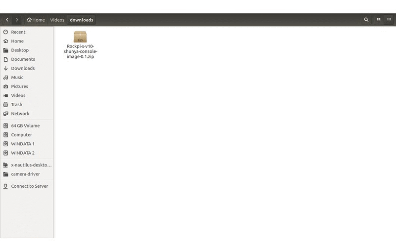

import Tabs from '@theme/Tabs';
import TabItem from '@theme/TabItem';

Shunya Interfaces comes pre-installed with version 0.3-Beta of Shunya OS.
To use shunya interfaces you need Shunya OS installed.

## Pre-requisites 
1. [Shunya OS Supported boards](http://releases.shunyaos.org/interfaces-images/)
2. SD card reader 
3. SD card 
4. Laptop 


## Installing Shunya OS 

### Step 1 : Install Etcher 

<Tabs
  defaultValue="nix"
  values={[
    { label: 'Windows', value: 'win', },
    { label: 'Ubuntu', value: 'nix', },
  ]
}>


<TabItem value="nix">

#### For Ubuntu 16.04 
1. Run this command in the Terminal 

```bash
$ sudo apt update
$ sudo apt install balena-etcher-electron
```

</TabItem>
<TabItem value="win">

#### For Windows
1. Download [balenaEtcher](https://www.balena.io/etcher/) for Windows. 
2. Run balenaEtcherSetup-xxx.exe

</TabItem>
</Tabs>

### Step 2 : Flash Shunya OS  

1. Download [Shunya OS](http://releases.shunyaos.org/interfaces-images/)
1. Right click on the downloaded zip file.
1. Click Extract here.
1. Open Etcher.
1. Click Select Image.
1. You will find the Shunya OS `.img` file in the folder that we had extracted earlier. 
1. Select `shunya-aaaa-image-xxxx.img` file.
1. Insert SD card.
1. Click on Flash. 



This will start loading the SD-card with Shunya OS.

### Step 3 :  Booting Up with Shunya OS 
1. Insert the SD card into the board 
2. Connect Keyboard and Mouse to the board 
3. Connect Monitor (if available ) to the board 
4. Connect Power Supply 


The board should boot up to Shunya OS.

#### Login 
Login with:
Username : shunya
Password : shunya 
