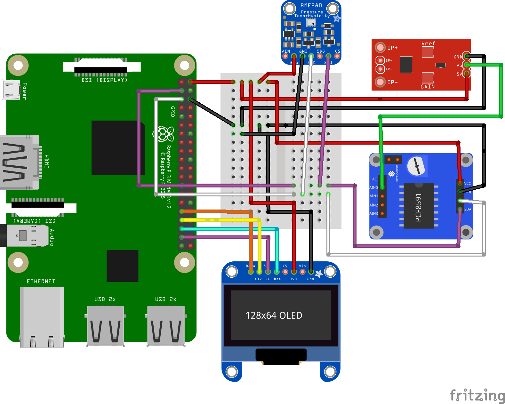

import Tabs from '@theme/Tabs';
import TabItem from '@theme/TabItem';
import useBaseUrl from '@docusaurus/useBaseUrl';


## Introduction 

In this project we will be monitoring various environmental parameters
critical for crops and will store the data and create graphs with the 
data getting logged.

;

## Ingredients for the Recipe 
1. Raspberry Pi 3/4 (or any variant of these)
1. SD card with Shunya OS installed, [instructions](01-installation.md)
1. Temperature, Pressure sensor - BME280  
1. Soil Moisture sensor 
1. Analog to Digital Converter PCF8591 module
1. OLED Display (128x64) (optional)
1. Wire Cutter 
1. Screwdriver 
1. Micro SD card Reader
1. Female to Female Du-point cables  
1. Laptop or Server Installed with Influxdb and Grafana

## Step 1: Hardware Setup




## Step 2: Lets code!

Our device must be able to do 
1. Read Temperature 
2. Read Pressure 
3. Read Soil Moisture 
4. Send it to Dashboard
5. Repeat after 10 minutes 

Coding is simple with Shunya Interfaces 

### Skeleton structure of Shunya Interfaces

<Tabs
  defaultValue="c"
  values={[
    { label: 'C/CPP', value: 'c', },
  ]
}>

<TabItem value="c">

```c
/*Include this header file into your program */
#include <shunyaInterfaces.h>

/* Main Function */
int main(void) {
        /* initialize the Library*/
        initLib();
        return 0;
}
```

</TabItem>
<TabItem value="py">

```py
import shunyaInterfaces 
```

</TabItem>
<TabItem value="js">

```js
var commingsoon = 1;
```

</TabItem>
</Tabs>


### API for reading Temperature from the sensor is  

<Tabs
  defaultValue="c"
  values={[
    { label: 'C/CPP', value: 'c', },
  ]
}>

<TabItem value="c">

```c
/* Add this line to your main function 
 * to read data from the sensor */
float temp = getCelsius();

```

</TabItem>
<TabItem value="py">

```py
import shunyaInterfaces 
```

</TabItem>
<TabItem value="js">

```js
var commingsoon = 1;
```

</TabItem>
</Tabs>


### API for reading Pressure from the sensor is  

<Tabs
  defaultValue="c"
  values={[
    { label: 'C/CPP', value: 'c', },
  ]
}>

<TabItem value="c">

```c
/* Add this line to your main function 
 * to read data from the sensor */
float pressure = getPa();

``` 

</TabItem>
<TabItem value="py">

```py
import shunyaInterfaces 
```

</TabItem>
<TabItem value="js">

```js
var commingsoon = 1;
```

</TabItem>
</Tabs>


### API for reading Soil moisture from the sensor is  


<Tabs
  defaultValue="c"
  values={[
    { label: 'C/CPP', value: 'c', },
  ]
}>

<TabItem value="c">

```c
/* Add this line to your main function 
 * to read data from the sensor */
int moisture = getAdc(1);

``` 

</TabItem>
<TabItem value="py">

```py
import shunyaInterfaces 
```

</TabItem>
<TabItem value="js">

```js
var commingsoon = 1;
```

</TabItem>
</Tabs>


### Send the Data to Dashboard  

<Tabs
  defaultValue="c"
  values={[
    { label: 'C/CPP', value: 'c', },
  ]
}>

<TabItem value="c">

```c
/*Include this header file into your program */
#include <curl/curl.h>

#define DASBOARD_IP_ADDR "192.168.0.109"
#define DB_NAME "foo_farm"

/* Add these line to your main function  */
sprintf (&buf, "measurement,host=sensor value=%.2f", temp);
sendToDashboard(buf);

```

</TabItem>
<TabItem value="py">

```py
import shunyaInterfaces 
```

</TabItem>
<TabItem value="js">

```js
var commingsoon = 1;
```

</TabItem>
</Tabs>

:::warning
This recipe assumes that you already have installed Grafana and Influxdb on your
server or laptop and the applications are running.
:::

Here is the full code.


<Tabs
  defaultValue="c"
  values={[
    { label: 'C/CPP', value: 'c', },
  ]
}>

<TabItem value="c">

```c
#include <stdlib.h>
#include <stdio.h>

#include <shunyaInterfaces.h>
#include <simple-mode.h>
#include <functions.h>

#define DASBOARD_IP_ADDR "192.168.0.109"
#define DB_NAME "foo_farm"

int sendToDashboard(char *msg) {
        CURL *curl;
        CURLcode res;
        char addr[1024];
        sprintf (&addr, "http://%s:8086/write?db=%s", DASBOARD_IP_ADDR, DB_NAME);
        curl = curl_easy_init();
        if(curl) {
                curl_easy_setopt(curl, CURLOPT_URL, addr);
                curl_easy_setopt(curl, CURLOPT_POSTFIELDS, msg);
                res = curl_easy_perform(curl);
                if(res != CURLE_OK)
                        fprintf(stderr, "curl_easy_perform failed: %s\n", curl_easy_strerror(res));
                curl_easy_cleanup(curl);
        }
        curl_global_cleanup();
        return 0;
}

void main(void)
{
        char buf[36];

        /*Initialize Shunya Interfaces library*/
        initLib();
        
        while (1)
        {       
                /* Read data from the sensor */
                float temp = getCelsius();
                float pressure = getPa();
                int moisture =  getAdc(1);
                
                char buf[128];
                /* Send data to dashboard */
                sprintf (&buf, "temperature,host=bme280 temp=%.2f", temp);
                sendToDashboard(buf);
                sprintf (&buf, "pressure,host=bme280 pressure=%.2f", pressure);
                sendToDashboard(buf);
                sprintf (&buf, "soil.moisture,host=pcf8591 moisture=%.2f", moisture);
                sendToDashboard(buf);

                delay(10*60*1000);
        }
}

```

</TabItem>
<TabItem value="py">

```py
import shunyaInterfaces 
```

</TabItem>
<TabItem value="js">

```js
var commingsoon = 1;
```

</TabItem>
</Tabs>


## Step 3: Configure, Compile and Run

To configure shunya interfaces, you need to tell shunya interfaces what all sensors are connected
Run this command,
```
$ sudo vi /etc/shunya/interfaces/config.yaml
```

Since we have connected 2 devices to the RPI (BME280 and PCF8591) to pin 3 & pin 5 respectively
You need to write these to the config file

```yaml

pin 3: [1.1, 6.1]
pin 4: null
pin 5: [1.2, 6.2]
```

Where `1` is the sensor id of BME280 while `6` is the sensor id for PCF8591.

Save and Exit the config file. 

To compile the code, run this command in terminal 

```bash
$ gcc -o iotfarm iotfarm.c -lshunyaInterfaces_user -lshunyaInterfaces_core -lcurl
$ sudo ./iotfarm  
```

